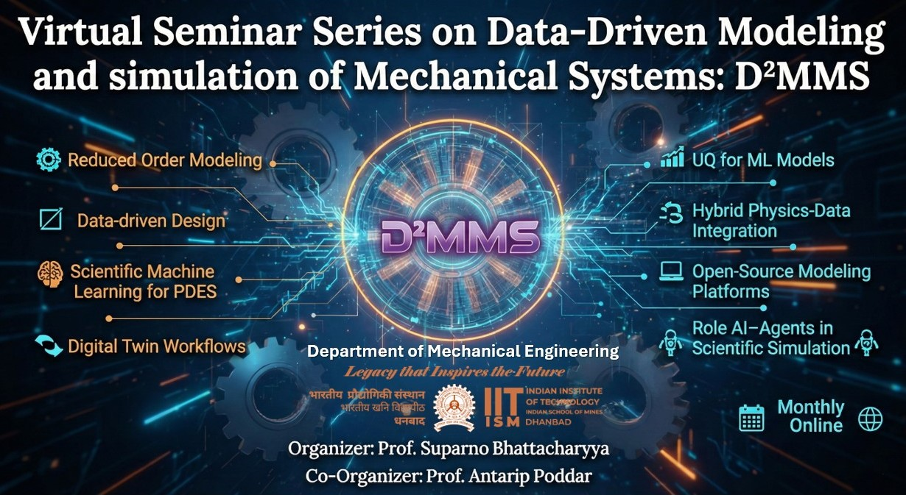
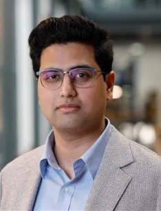
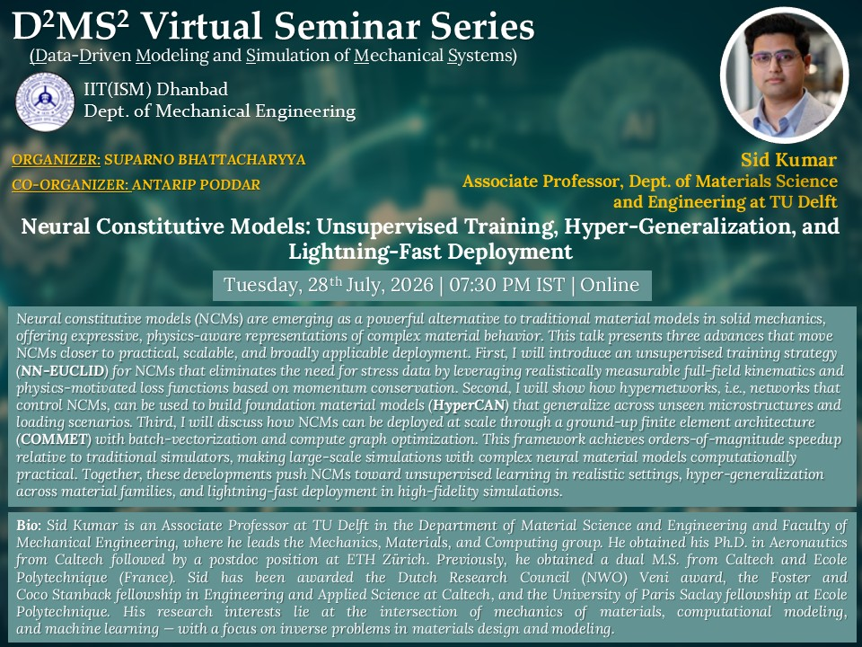
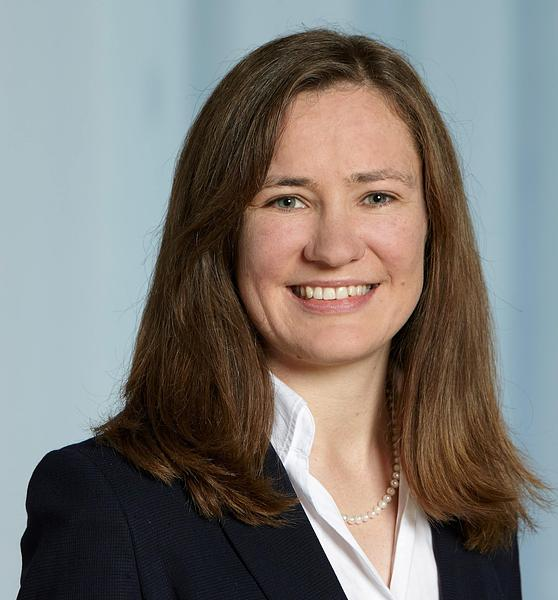
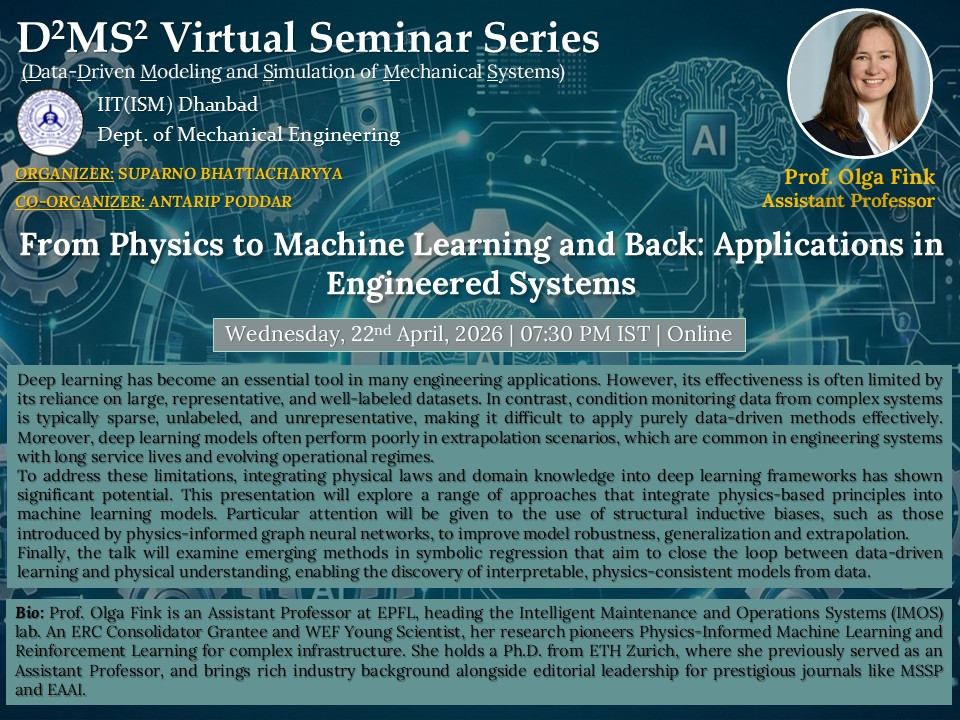
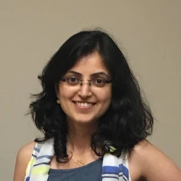
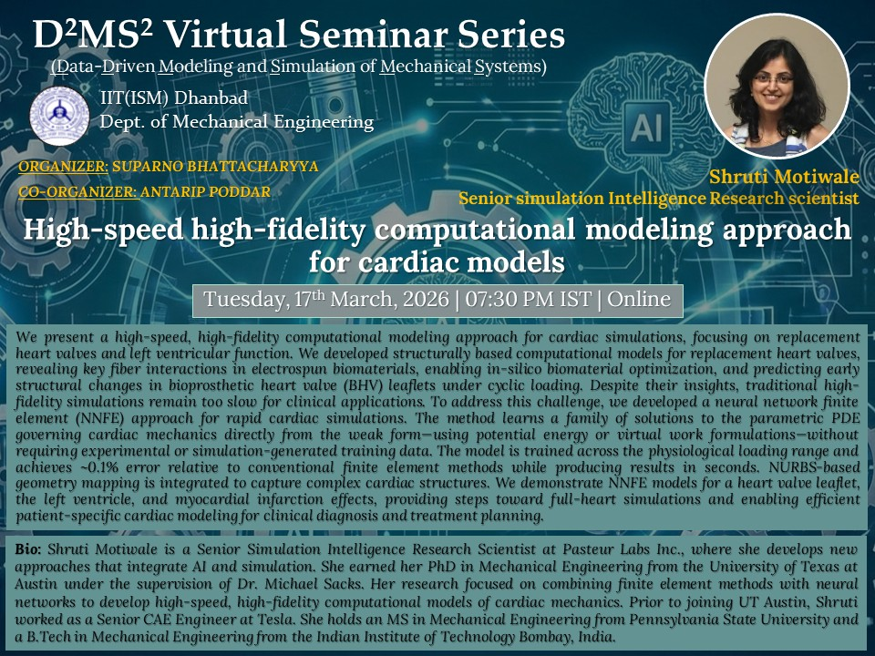
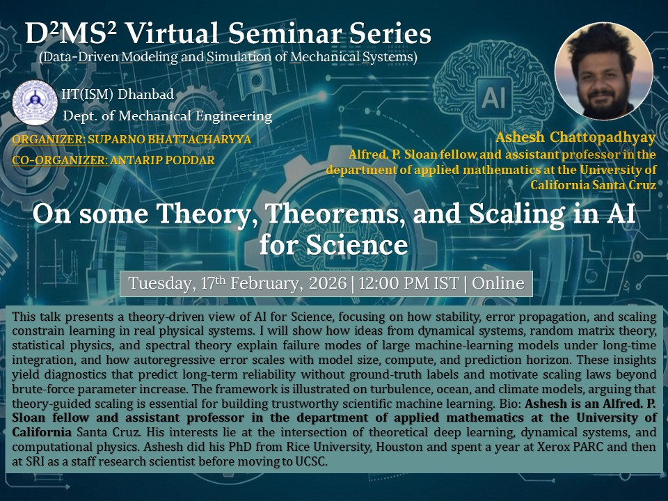
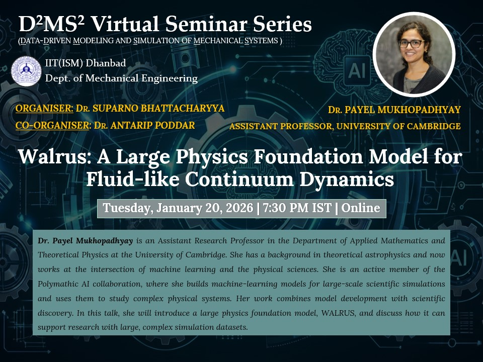

# Data-Driven Modeling and Simulation of Mechanical Systems(D²MS²) Virtual Seminar Series {.text-center}

:::::::::::: {.grid .gap-4}
::::::: {.g-col-12 .g-col-md-7}
:::::: {.card .h-100}
::: {.card-header_1 .bg-primary .text-white}
### About the Series
:::

:::: card-body
**D²MS²** is a monthly virtual seminar series hosted by the **Department of Mechanical Engineering, IIT (ISM) Dhanbad**.

We explore the frontiers of data-informed and physics-based modeling for mechanical, fluid, and thermal systems.

**Organized by:** Department of Mechanical Engineering\
**Institution:** Indian Institute of Technology (Indian School of Mines), Dhanbad

::: text-center
[<i class="bi bi-youtube"></i> Watch on YouTube](https://www.youtube.com/@D2MS2){.btn .btn-danger}
:::
::::
::::::
:::::::

:::::: {.g-col-12 .g-col-md-5}
::::: {.card .h-100}
::: {.card-header_1 .bg-primary .text-white}
### Core Themes
:::

::: card-body
-   🔹 Reduced-order modeling
-   🔹 Scientific ML for PDEs
-   🔹 Digital twins
-   🔹 Hybrid physics–data methods
-   🔹 UQ for ML
-   🔹 Open-source platforms
-   🔹 AI agents for simulation
:::
:::::
::::::
::::::::::::

<!-- ============ BANNER 1: IMAGE ============ -->

::: banner-container
{.banner-img}
:::

## 🎙️ Upcoming Talk {.text-center .mt-4}

:::::::::::: {.card .border-primary .mb-4}
::: {.card-header_1 .bg-primary .text-white}
### 📅 July 28, 2026 \| 🕢 07:30 PM IST
:::

:::::::::: card-body
::::::::: grid
:::: {.g-col-12 .g-col-md-3 .speaker-column}
::: speaker-profile
{.speaker-img}

**Prof. Sid Kumar**
:::
::::

::::: {.g-col-12 .g-col-md-8}
### Neural Constitutive Models: Unsupervised Training, Hyper-Generalization, and Lightning-Fast Deployment

::: abstract-section
### Abstract

Neural constitutive models (NCMs) are emerging as a powerful alternative to traditional material models in solid mechanics, offering expressive, physics-aware representations of complex material behavior. This talk presents three advances that move NCMs closer to practical, scalable, and broadly applicable deployment. First, I will introduce an unsupervised training strategy (NN-EUCLID) for NCMs that eliminates the need for stress data by leveraging realistically measurable full-field kinematics and physics-motivated loss functions based on momentum conservation. Second, I will show how hypernetworks, i.e., networks that control NCMs, can be used to build foundation material models (HyperCAN) that generalize across unseen microstructures and loading scenarios. Third, I will discuss how NCMs can be deployed at scale through a ground-up finite element architecture (COMMET) with batch-vectorization and compute graph optimization. This framework achieves orders-of-magnitude speedup relative to traditional simulators, making large-scale simulations with complex neural material models computationally practical. Together, these developments push NCMs toward unsupervised learning in realistic settings, hyper-generalization across material families, and lightning-fast deployment in high-fidelity simulations.

**Bio:** Sid Kumar is an Associate Professor at TU Delft in the Department of Material Science and Engineering and Faculty of Mechanical Engineering, where he leads the Mechanics, Materials, and Computing group. He obtained his Ph.D. in Aeronautics from Caltech followed by a postdoc position at ETH Zürich. Previously, he obtained a dual M.S. from Caltech and Ecole Polytechnique (France). Sid has been awarded the Dutch Research Council (NWO) Veni award, the Foster and Coco Stanback fellowship in Engineering and Applied Science at Caltech, and the University of Paris Saclay fellowship at Ecole Polytechnique. His research interests lie at the intersection of mechanics of materials, computational modeling, and machine learning — with a focus on inverse problems in materials design and modeling.
:::

::: text-center
[**Webinar Link**](https://teams.microsoft.com/meet/47447891637913?p=bJkBkqTqYrGzlrHV89){.btn-walrus}

[**Register Here**](https://forms.gle/pJA89hAoiBz44Rts9){.btn-walrus}
:::
:::::

::: {.g-col-12 .g-col-md-4 .d-flex .align-items-center .justify-content-center}
:::
:::::::::
::::::::::
::::::::::::

::: banner-container
{.banner-img}
:::

:::::::::::: {.card .border-primary .mb-4}
::: {.card-header_1 .bg-primary .text-white}
### 📅 April 22, 2026 \| 🕢 07:30 PM IST
:::

:::::::::: card-body
::::::::: grid
:::: {.g-col-12 .g-col-md-3 .speaker-column}
::: speaker-profile
{.speaker-img}

**Prof. Olga Fink**
:::
::::

::::: {.g-col-12 .g-col-md-8}
### From Physics to Machine Learning and Back: Applications in Engineered Systems

::: abstract-section
### Abstract

Deep learning has become an essential tool in many engineering applications. However, its effectiveness is often limited by its reliance on large, representative, and well-labeled datasets. In contrast, condition monitoring data from complex systems is typically sparse, unlabeled, and unrepresentative, making it difficult to apply purely data-driven methods effectively. Moreover, deep learning models often perform poorly in extrapolation scenarios, which are common in engineering systems with long service lives and evolving operational regimes. To address these limitations, integrating physical laws and domain knowledge into deep learning frameworks has shown significant potential. This presentation will explore a range of approaches that integrate physics-based principles into machine learning models. Particular attention will be given to the use of structural inductive biases, such as those introduced by physics-informed graph neural networks, to improve model robustness, generalization and extrapolation. Finally, the talk will examine emerging methods in symbolic regression that aim to close the loop between data-driven learning and physical understanding, enabling the discovery of interpretable, physics-consistent models from data.

**Bio:** Olga Fink has been assistant professor at EPFL since March 2022, heading the Intelligent Maintenance and Operations Systems (IMOS) laboratory. She is the recipient of an ERC Consolidator Grant. Olga’s research focuses on Physics-Informed Machine Learning, Multi-Modal Learning, Domain Adaptation and Generalization, and Reinforcement Learning for Intelligent Maintenance and Operations of Infrastructure and Complex Assets. Before joining EPFL faculty, Olga was assistant professor of intelligent maintenance systems at ETH Zurich from 2018 to 2022, being awarded the prestigious professorship grant of the Swiss National Science Foundation (SNSF). Between 2014 and 2018 she was heading the research group “Smart Maintenance” at the Zurich University of Applied Sciences (ZHAW). Olga received her Ph.D. degree from ETH Zurich, and Diploma degree from Hamburg University of Technology. She has gained valuable industrial experience as reliability engineer with Stadler Bussnang AG and as reliability and maintenance expert with Pöyry Switzerland Ltd. Olga is serving as an editorial board member of several prestigious journals, including Mechanical Systems and Signal Processing, Engineering Applications of Artificial Intelligence and Reliability Engineering and System Safety. In 2019, Olga earned the distinction of being recognized as a young scientist of the World Economic Forum. In 2020, 2021, and 2024 she was honored as a young scientist of the World Laureate Forum. In 2023, she was distinguished as a fellow by the Prognostics and Health Management Society.
:::

::: text-center
[**Webinar Link**](https://teams.microsoft.com/meet/47447891637913?p=bJkBkqTqYrGzlrHV89){.btn-walrus}

[**Register Here**](https://forms.gle/pJA89hAoiBz44Rts9){.btn-walrus}
:::
:::::

::: {.g-col-12 .g-col-md-4 .d-flex .align-items-center .justify-content-center}
:::
:::::::::
::::::::::
::::::::::::

::: banner-container
{.banner-img}
:::

:::::::::::: {.card .border-primary .mb-4}
::: {.card-header_1 .bg-primary .text-white}
### 📅 March 17, 2026 \| 🕢 07:30 PM IST
:::

:::::::::: card-body
::::::::: grid
:::: {.g-col-12 .g-col-md-3 .speaker-column}
::: speaker-profile
{.speaker-img}

**Dr. Shruti Motiwale**
:::
::::

::::: {.g-col-12 .g-col-md-8}
### High-speed high-fidelity computational modeling approach for cardiac models

::: abstract-section
### Abstract

We present a high-speed, high-fidelity computational modeling approach for cardiac simulations, focusing on replacement heart valves and left ventricular function. We developed structurally based computational models for replacement heart valves, revealing key fiber interactions in electrospun biomaterials, enabling in-silico biomaterial optimization, and predicting early structural changes in bioprosthetic heart valve (BHV) leaflets under cyclic loading. Despite their insights, traditional high-fidelity simulations remain too slow for clinical applications. To address this challenge, we developed a neural network finite element (NNFE) approach for rapid cardiac simulations. The method learns a family of solutions to the parametric PDE governing cardiac mechanics directly from the weak form—using potential energy or virtual work formulations—without requiring experimental or simulation-generated training data. The model is trained across the physiological loading range and achieves \~0.1% error relative to conventional finite element methods while producing results in seconds. NURBS-based geometry mapping is integrated to capture complex cardiac structures. We demonstrate NNFE models for a heart valve leaflet, the left ventricle, and myocardial infarction effects, providing steps toward full-heart simulations and enabling efficient patient-specific cardiac modeling for clinical diagnosis and treatment planning.

**Bio:** Shruti Motiwale is a Senior Simulation Intelligence Research Scientist at Pasteur Labs Inc., where she develops new approaches that integrate AI and simulation. She earned her PhD in Mechanical Engineering from the University of Texas at Austin under the supervision of Dr. Michael Sacks. Her research focused on combining finite element methods with neural networks to develop high-speed, high-fidelity computational models of cardiac mechanics. Prior to joining UT Austin, Shruti worked as a Senior CAE Engineer at Tesla. She holds an MS in Mechanical Engineering from Pennsylvania State University and a B.Tech in Mechanical Engineering from the Indian Institute of Technology Bombay, India.
:::

::: text-center
[**Webinar Link**](https://teams.microsoft.com/meet/47447891637913?p=bJkBkqTqYrGzlrHV89){.btn-walrus}

[**Register Here**](https://forms.gle/pJA89hAoiBz44Rts9){.btn-walrus}
:::
:::::

::: {.g-col-12 .g-col-md-4 .d-flex .align-items-center .justify-content-center}
:::
:::::::::
::::::::::
::::::::::::

::: banner-container
{.banner-img}
:::

:::::::::::: {.card .border-primary .mb-4}
::: {.card-header_1 .bg-primary .text-white}
### 📅 February 17, 2026 \| 🕢 12:00 PM IST
:::

:::::::::: card-body
::::::::: grid
:::: {.g-col-12 .g-col-md-3 .speaker-column}
::: speaker-profile
{.speaker-img}

**Prof. Ashesh Chattopadhyay**
:::
::::

::::: {.g-col-12 .g-col-md-8}
### On some Theory, Theorems, and Scaling in AI for Science

::: abstract-section
### Abstract

This talk presents a theory-driven view of AI for Science, focusing on how stability, error propagation, and scaling constrain learning in real physical systems. I will show how ideas from dynamical systems, random matrix theory, statistical physics, and spectral theory explain failure modes of large machine-learning models under long-time integration, and how autoregressive error scales with model size, compute, and prediction horizon. These insights yield diagnostics that predict long-term reliability without ground-truth labels and motivate scaling laws beyond brute-force parameter increase. The framework is illustrated on turbulence, ocean, and climate models, arguing that theory-guided scaling is essential for building trustworthy scientific machine learning.

**Bio:** Ashesh is an Alfred. P. Sloan fellow and assistant professor in the department of applied mathematics at the University of California Santa Cruz. His interests lie at the intersection of theoretical deep learning, dynamical systems, and computational physics. Ashesh did his PhD from Rice University, Houston and spent a year at Xerox PARC and then at SRI as a staff research scientist before moving to UCSC.
:::

::: text-center
[**Webinar Link**](https://teams.microsoft.com/meet/47447891637913?p=bJkBkqTqYrGzlrHV89){.btn-walrus}

[**Register Here**](https://forms.gle/pJA89hAoiBz44Rts9){.btn-walrus}
:::
:::::

::: {.g-col-12 .g-col-md-4 .d-flex .align-items-center .justify-content-center}
:::
:::::::::
::::::::::
::::::::::::

::: banner-container
{.banner-img}
:::

:::::::::::: {.card .border-primary .mb-4}
::: {.card-header_1 .bg-primary .text-white}
### 📅 January 20, 2026 \| 🕢 7:30 PM IST
:::

:::::::::: card-body
::::::::: grid
:::: {.g-col-12 .g-col-md-3 .speaker-column}
::: speaker-profile
{.speaker-img}

**Dr. Payel Mukhopadhyay**\
*Assistant Research Professor*\
*University of Cambridge*
:::
::::

::::: {.g-col-12 .g-col-md-8}
### Walrus: A Large Physics Foundation Model for Fluid-Like Continuum Dynamics

::: abstract-section
### Abstract

Foundation models have transformed machine learning for language and vision, but achieving comparable impact in physical simulation remains a challenge. Data heterogeneity and unstable long-term dynamics inhibit learning from sufficiently diverse dynamics, while varying resolutions and dimensionalities challenge efficient training on modern hardware. Through empirical and theoretical analysis, we incorporate new approaches to mitigate these obstacles, including a harmonic-analysis-based stabilization method, load-balanced distributed 2D and 3D training strategies, and compute-adaptive tokenization. Using these tools, we develop Walrus, a transformer-based foundation model developed primarily for fluid-like continuum dynamics. Walrus is pretrained on nineteen diverse scenarios spanning astrophysics, geoscience, rheology, plasma physics, acoustics, and classical fluids. Experiments show that Walrus outperforms prior foundation models on both short and long term prediction horizons on downstream tasks and across the breadth of pretraining data, while ablation studies confirm the value of our contributions to forecast stability, training throughput, and transfer performance over conventional approaches.
:::

::: text-center
[**Webinar Link**](https://teams.microsoft.com/meet/47447891637913?p=bJkBkqTqYrGzlrHV89){.btn-walrus}

[**Register Here**](https://lnkd.in/gN5ye8EX){.btn-walrus}
:::
:::::

::: {.g-col-12 .g-col-md-4 .d-flex .align-items-center .justify-content-center}
:::
:::::::::
::::::::::
::::::::::::

::: banner-container
{.banner-img}
:::

## 👥 Organizers {.text-center .mt-4}

::::::::: {.grid .justify-content-center}
::::: {.g-col-12 .g-col-md-4}
:::: {.card .text-center .h-100}
::: card-body
**Dr. Suparno Bhattacharyya**\
*Organizer*
:::
::::
:::::

::::: {.g-col-12 .g-col-md-4}
:::: {.card .text-center .h-100}
::: card-body
**Dr. Antarip Poddar**\
*Co-Organizer*
:::
::::
:::::
:::::::::

------------------------------------------------------------------------

*For queries, please contact the organizers at the Department of Mechanical Engineering, IIT (ISM) Dhanbad.*
