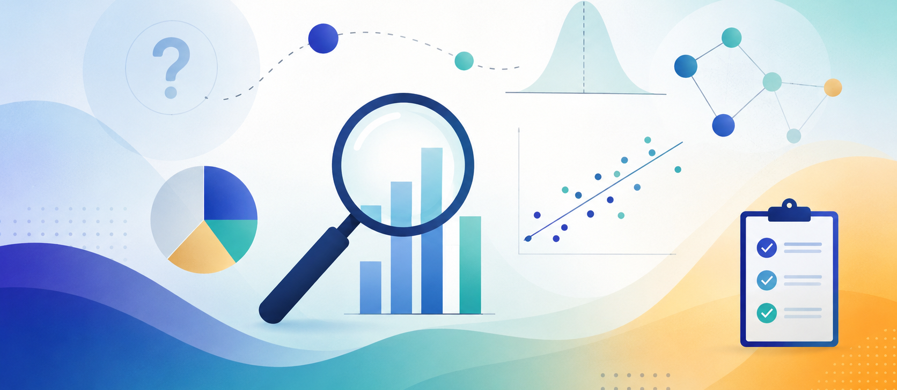

{style="width:100%; height:250px; object-fit:cover; border-radius:8px; margin-bottom:1rem;"}

## Course Information

**Instructor:** Prof. Suparno Bhattacharyya  
**Email:** [suparno@iitism.ac.in](mailto:suparno@iitism.ac.in)  
**Office Location:** Room No. 224A, Mechanical Engineering Department  
**Office Hours:** Virtual, by appointment  
**Course Website:** This website  
**Level:** Master’s/Ph.D  
**Prerequisites:** Coursework in Research Methodology  

**Course source code:** [](https://github.com/suparnobhattacharyya)

## In Slide Form


```{=html}
<iframe
  src="../docs/course_1/intro.html"
  title="Research Methodology slides"
  width="100%"
  height="500"
  style="border:0; border-radius:12px;"
  loading="fast"
  allowfullscreen>
</iframe>
```


## Course Content {#description}

This course introduces students to the foundational principles of research methodology, with a focus on scientific and engineering contexts. It covers the essential stages of conducting research, beginning with the formulation of a clear and structured research problem. Students learn how to identify research gaps, develop hypotheses, and design strategies to investigate their questions systematically.

Emphasis is placed on understanding how to plan and execute a research study, including the collection and interpretation of data. The course also provides an introduction to the key statistical tools necessary for analyzing empirical findings and drawing meaningful conclusions, thereby preparing students to engage in rigorous, evidence-based inquiry.

### Learning Outcomes {#outcomes}

On successful completion of the course, students will be able to:

i. Identify, design, and execute a research problem using various research processes and methodologies grounded in scientific and statistical tools.

ii. Apply various sample design techniques and their classification, recognise the characteristics of a good sample design, and select a sampling procedure for data collection.

iii. Distinguish among types of measurement scales, identify sources of error in measurement, and develop measurement tools to evaluate collected data.

iv. Use various methods of data collection while assessing the reliability and validity of the collected data.

v. Prepare and present reports through different approaches for the dissemination of research outcomes.

vi. Employ the statistical tools necessary for designing a sample, analyzing data, and drawing scientific conclusions to arrive at a research outcome.

## Course Materials {#textbooks}

### Textbooks

1. Kothari, C. R., and Gaurav Garg. 2019. *Research Methodology — Methods and Techniques*. 4th ed. New Delhi: New Age International (P) Limited Publishers.

2. Montgomery, Douglas C., and George C. Runger. 2016. *Applied Statistics and Probability for Engineers*. 6th ed.

3. Kumar, Ranjit. 2018. *Research Methodology: A Step-by-Step Guide for Beginners*. 5th ed. SAGE Publications Ltd.

### Software {#software}

Analyses and assignments use `R` and/or `Python`. Either environment is acceptable for the statistical components and the course project.

### Course Format {#format}

The course is delivered through lectures combined with group work.

## Assessment & Grading {#grading}

### Grade Components

| Component | Weight | Format |
|---|:---:|---|
| Midterm Exam | 30% | Multiple-choice questions (MCQ) |
| End-Semester Examination | 50% | Long-answer type |
| Project Presentation | 10% | PowerPoint presentations in groups |
| Quiz | 10% | Pre-midsem quiz |

### Projects {#projects}

The project requires students to formulate a research problem, collect or simulate data, and apply appropriate statistical tools to analyze the results. Emphasis is placed on correct interpretation of data and justification of conclusions using sound statistical reasoning. Students must present their work in the form of a structured research report and an oral presentation, following standard scientific communication practices.

## Course Policies {#integrity}

### Academic Integrity

Students are expected to uphold academic integrity in all coursework and research. All submissions must reflect the student's own understanding and effort.

::: {.callout-important title="Use of AI Tools"}
The use of AI tools (e.g., ChatGPT, Copilot, Grammarly) is permitted only if explicitly allowed by the instructor. Any use must be properly disclosed, including the nature and extent of assistance. Unauthorized or undisclosed AI use — such as generating entire assignments, fabricating data, or bypassing individual work requirements — constitutes academic misconduct and is subject to disciplinary action per institutional guidelines. **When in doubt, consult the instructor before using AI tools.**
:::

### Accessibility & Accommodations {#accessibility}

Students with documented disabilities, chronic medical conditions, or other special needs are encouraged to inform the instructor at the beginning of the semester to arrange appropriate accommodations. In the event of accidents, medical emergencies, or other unforeseen circumstances affecting attendance or coursework, students must notify the instructor promptly and provide official documentation (e.g., medical certificate, accident report, or institutional approval) to support requests for accommodations, extensions, or make-up work. Reasonable efforts will be made to ensure academic continuity in consultation with relevant institutional offices.

### Communication {#communication}

::: {.callout-warning title="Email is the official channel"}
WhatsApp may be used by the instructor for broadcasting only. All other communication must happen via email — no other communication protocol will be entertained.
:::

## Key Dates {#dates}

| Event | Date |
|---|---|
| Midterm | 27 February – 03 March, 2026 |
| Project due | 11th & 12th April, 2026 *(tentative)* |
| End-Sem Examination | 26 April – 03 May, 2026 |
| Holidays / No class | Consult the Academic Calendar |