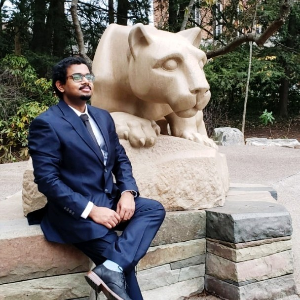
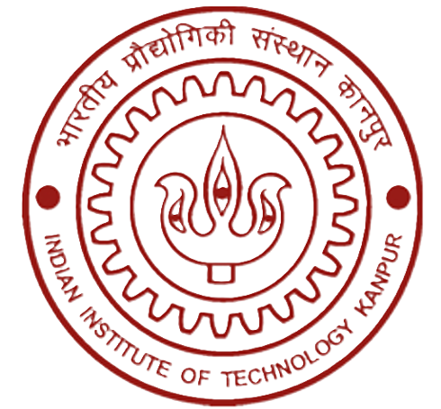
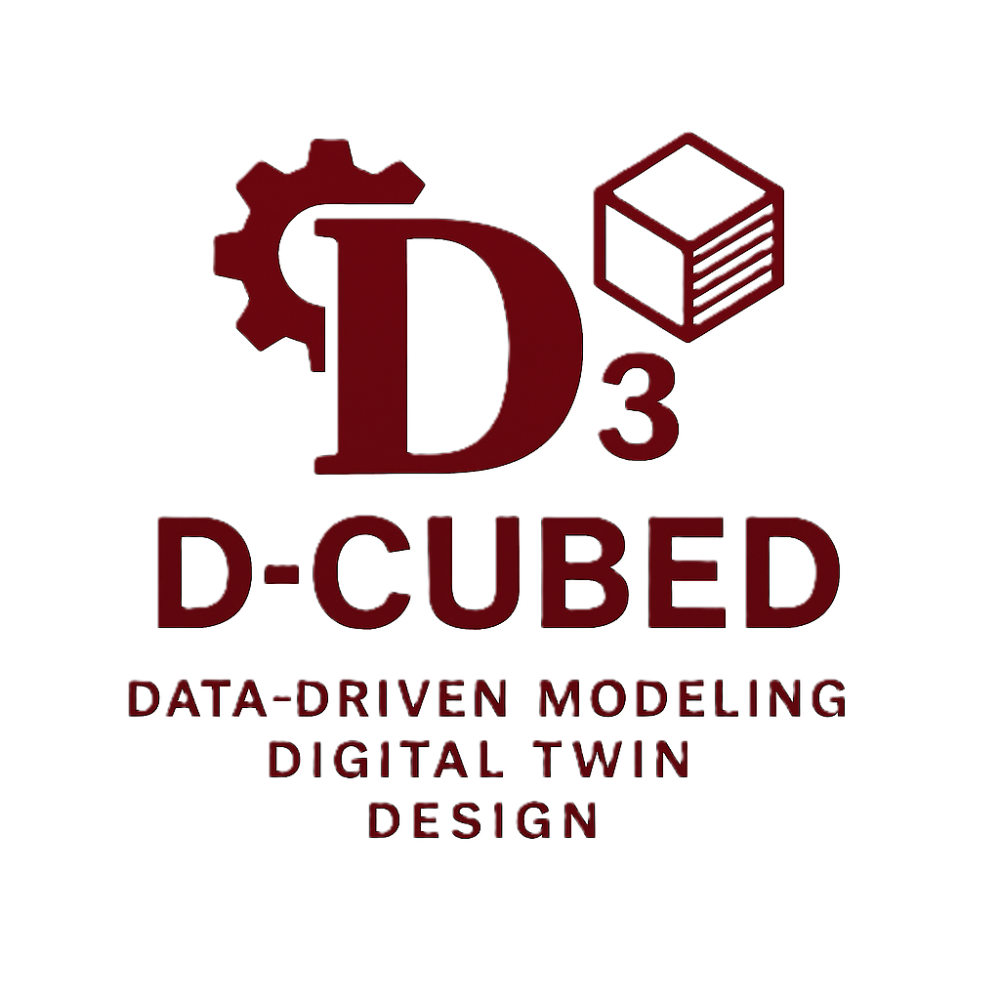
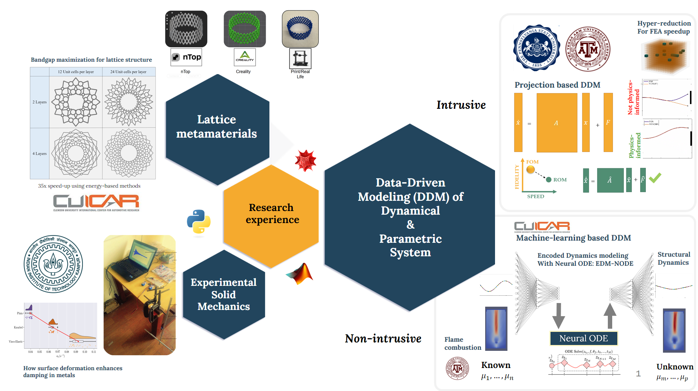

---
format:
  html:
    css: styles.css
    toc: false
    page-layout: article
---
{.profile-circle}


# About Me {.center-heading}


I am Dr. Suparno Bhattacharyya, Assistant Professor in the Department of Mechanical Engineering at IIT (ISM) Dhanbad. I hold a B.E. in Mechanical Engineering from Jadavpur University and an M.Tech. in Mechanical Engineering (Solid Mechanics) from IIT Kanpur, followed by a Ph.D. in Engineering Science and Mechanics from The Pennsylvania State University. Prior to my current appointment, I expanded my research experience as a Postdoctoral Scholar at Clemson University and an Assistant Research Scientist at the Digital Twin Lab at Texas A&M University.

My research centers on computational solid mechanics and data-driven modeling, with recent work on hyper-reduced order models for digital twin applications. Previous projects include vibro-impact modeling, topology optimization of lattice structures, and reduced-order strategies for systems under non-smooth loading. My master’s research focused on experimental characterization of structural damping in metals. More broadly, I work on reduced-order modeling, finite element analysis, computational mechanics, and nonlinear dynamics, supported by programming expertise in MATLAB, Mathematica, and Python.


::: {.logo-container-spread}




:::

<!-- BOTTOM ROW: IIT Dhanbad Logo centered -->
::: {.logo-container-center}
{style="max-width: 250px; max-height: 200px;"}
:::


# About D-cubed Lab {.center-heading}


{width=30% height=50% fig-align="center"}


<video src="/videos/99-line.mp4" width="800px" height="400px" style="border: 1.5px solid #fff; margin-bottom: 30px;" autoplay muted loop playsinline></video>


At the D-cubed Lab, we investigate and develop efficient modeling techniques for the simulation and design of complex engineering systems. Our research integrates **computational mechanics, topology optimization, and data-driven modeling,** with an emphasis on capturing mechanical and dynamical behavior across scales and applications.

A core theme of our work is the development of **intrusive and nonintrusive data-driven methods** that retain physical accuracy while enabling significant computational speed-ups. These tools are critical for simulating nonlinear, multiphysics phenomena efficiently—whether in structural dynamics, materials design, or energy systems.


{width="100%" style="margin: 40px auto;"}


Our contributions span:

• Data-driven ROMs for systems with discontinuities and nonlinearities

• Energy-based closure strategies for improved accuracy in low-dimensional models

• Topology optimization frameworks for periodic and lattice structures with tailored dynamic properties

• Integration of neural ODEs and machine learning into physics-based modeling pipelines

As a natural extension, we are increasingly applying these methods to support **digital twin technologies**, where real-time simulation and decision-making are essential. By enabling rapid yet accurate predictions in domains such as neutron transport, combustion, and manufacturing, our models help make digital twins a practical tool for engineering insight and control.

Our long-term goal is to push the limits of simulation-driven design, combining physics, computation, and data to tackle emerging challenges in modern engineering.


::: {.button-container}
<a href="news.qmd" class="btn-custom">News →</a>


<a href="labgroup.qmd" class="btn-custom">Lab group →</a>


<a href="Webinar.qmd" class="btn-custom">Webinar →</a>
:::


```{=html}
<style>

/* Ensure paragraphs, headings, and lists are left-aligned */
h1, h2, h3, h4, h5, h6, ul, ol {
  text-align: left !important;
}

/* Remove Bootstrap's default centering */
.container, .main-content {
  text-align: left !important;
}

/* Optional: Fix alignment for specific sections */
#about, #research-focus, #certifications {
  text-align: left !important;
}
</style>
```
